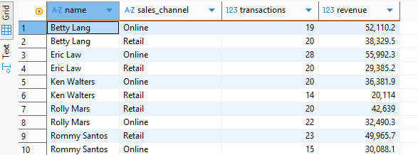

## Scenario 1: Employee Performance Analysis

### 🎯 Business Question
How are employee sales performance and commissions distributed?

### 🧠 SQL Logic Used
```sql
-- SQL query snippet here
-- =============================================
-- SCENARIO 1: EMPLOYEE INCENTIVE & PERFORMANCE
-- =============================================

-- 1. Commission Payout Report
-- Shows total commission earned by each employee
SELECT 
    e.name AS employee_name,
    e.job_code,
    COUNT(sc.sale_id) AS total_sales_count,
    SUM(sc.commission_amount) AS total_commission_earned
FROM employees e
JOIN sales_commission sc ON e.employee_id = sc.employee_id
GROUP BY e.name, e.job_code
ORDER BY total_commission_earned DESC;

### Total Cpommission Earned by Employee

|employee_name|job_code|total_sales_count|total_commission_earned|
|-------------|--------|-----------------|-----------------------|
|Betty Lang|SALES|39|4522.01|
|Eric Law|SALES|47|4255.92|
|Rommy Santos|SALES|37|3942.73|
|Rolly Mars|SALES|40|3785.45|
|Ken Walters|SALES|34|2824.87|

### 💡 Insights


-- 2. Performance Ranking (Revenue Based)
-- Ranks employees by the total revenue they generated
SELECT 
    e.name,
    SUM(s.quantity * p.price) AS total_revenue_generated,
    RANK() OVER (ORDER BY SUM(s.quantity * p.price) DESC) AS revenue_rank
FROM employees e
JOIN sales s ON e.employee_id = s.employee_id
JOIN products p ON s.product_id = p.product_id
WHERE e.job_code = 'SALES'
GROUP BY e.name;


-- 3. Sales Channel Split
-- Analyzes whether employees sell more Online or in Retail
SELECT 
    e.name,
    s.sales_channel,
    COUNT(*) AS transactions,
    SUM(s.quantity * p.price) AS revenue
FROM employees e
JOIN sales s ON e.employee_id = s.employee_id
JOIN products p ON s.product_id = p.product_id
GROUP BY e.name, s.sales_channel
ORDER BY e.name, revenue DESC;




